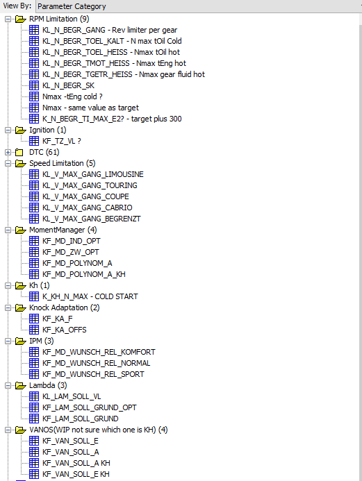

# MSS60 xdf file

# Colaborators Wanted! 
if you intrested in this repository, feel free to contact with me.

# Q&A
Q. Why the hell there are 2 definition files available? it can't be put parameters together in one file?
	A. Yes, it can be done.  
	but I already put +7000 0 address offset for the main file, because I thought there would be no need to edit before +7000 0 until now.  
	But yes, I can delete address offset from the main file, and adjust parameter address one by one, but that is clearly painful work.  
	so i leave it, and split into 2 files  
